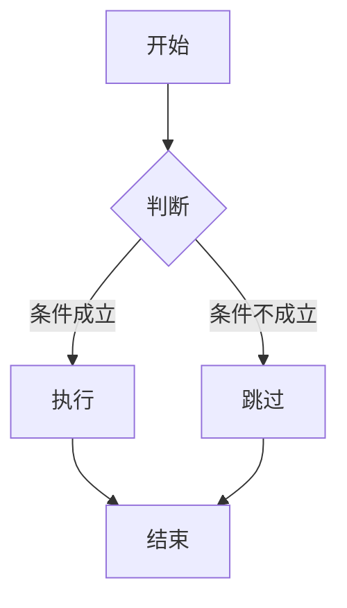
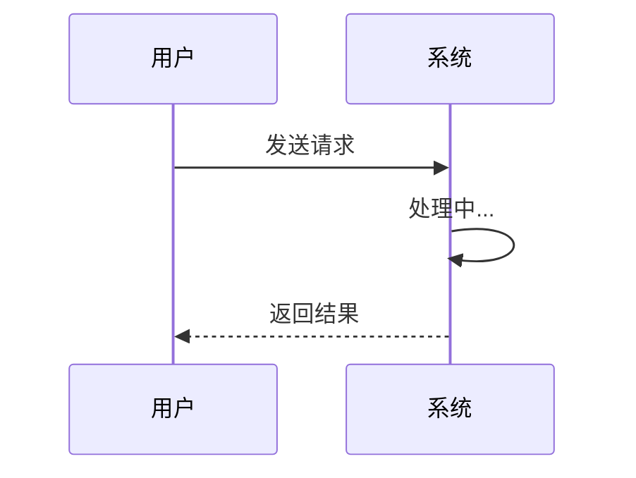
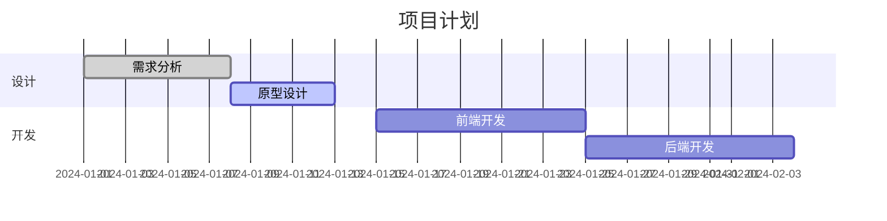

- [x] 此文档包含所有 Markdown 语法格式
- [ ] 用于验证 TyporaLight 主题渲染效果

# 1. 标题 / Headings

## 1.1 一级到六级标题

# 一级标题 H1
## 二级标题 H2

普通正文段落，用于测试默认字体、字号、行距、字间距和段间距。Typora is a cross-platform Markdown editor. 这里混合中英文来观察整体阅读感受。

### 三级标题 H3

普通正文段落，用于测试默认字体、字号、行距、字间距和段间距。Typora is a cross-platform Markdown editor. 这里混合中英文来观察整体阅读感受。

#### 四级标题 H4

普通正文段落，用于测试默认字体、字号、行距、字间距和段间距。Typora is a cross-platform Markdown editor. 这里混合中英文来观察整体阅读感受。

##### 五级标题 H5

普通正文段落，用于测试默认字体、字号、行距、字间距和段间距。Typora is a cross-platform Markdown editor. 这里混合中英文来观察整体阅读感受。

###### 六级标题 H6

普通正文段落，用于测试默认字体、字号、行距、字间距和段间距。Typora is a cross-platform Markdown editor. 这里混合中英文来观察整体阅读感受。

# 2. 文本样式 / Text Styles

## 2.1 基础样式

普通正文段落，用于测试默认字体、字号、行距、字间距和段间距。Typora is a cross-platform Markdown editor. 这里混合中英文来观察整体阅读感受。

**粗体文字 Bold** *斜体文字 Italic* ***粗斜体 Bold Italic***

~~删除线 Strikethrough~~ <u>下划线 Underline</u> ==高亮 Highlight==

上标 Superscript: X^2^ + Y^2^ = Z^2^

下标 Subscript: H~2~O

++插入文字 Insert++

--错误文字 Mistaken--

## 2.2 链接 / Links

[普通超链接](https://typora.io)

[带标题的链接](https://typora.io "Typora 官网")

自动链接: <https://typora.io>

## 2.3 图片 / Images


## 2.4 列表 / Lists

### 无序列表

- 苹果 Apple
- 香蕉 Banana
- 樱桃 Cherry
  - 嵌套无序项一
  - 嵌套无序项二
    - 三级嵌套

### 有序列表

1. 第一项
2. 第二项
3. 第三项
   1. 嵌套有序项一
   2. 嵌套有序项二

### 任务列表

- [x] 已完成任务
- [ ] 未完成任务
- [ ] 待办事项

### 定义列表

Markdown
: 一种轻量级标记语言

Typora
: 一款跨平台的 Markdown 编辑器

## 2.5 引用 / Blockquotes

> 这是一级引用。
>
> 引用内可以包含 **粗体** 和 `行内代码`。
>
> > 这是二级嵌套引用。
> >
> > > 这是三级嵌套引用。

## 2.6 分隔线 / Horizontal Rules

---

***

## 2.7 代码 / Code

### 行内代码

在段落中插入 `print("Hello, World!")` 这样的行内代码。

### 代码块（无语言标注）

```
This is a plain code block.
No language specified.
```

### 代码块（Python）

```python
import os
from typing import List, Optional


def fibonacci(n: int) -> List[int]:
    """Generate Fibonacci sequence up to n terms."""
    fib: List[int] = [0, 1]
    for i in range(2, n):
        fib.append(fib[i-1] + fib[i-2])
    return fib[:n]


# 测试代码
result = fibonacci(10)
print(f"Fibonacci: {result}")  # Output: Fibonacci: [0, 1, 1, 2, 3, 5, 8, 13, 21, 34]
```

### 代码块（JavaScript）

```javascript
const greet = (name) => {
    console.log(`Hello, ${name}!`);
    return `Hello, ${name}!`;
};

class Person {
    constructor(name, age) {
        this.name = name;
        this.age = age;
    }

    introduce() {
        return `I'm ${this.name}, ${this.age} years old.`;
    }
}
```

### 代码块（CSS）

```css
.container {
    display: flex;
    justify-content: center;
    align-items: center;
    min-height: 100vh;
    background: linear-gradient(135deg, #667eea 0%, #764ba2 100%);
}

.card {
    padding: 2rem;
    border-radius: 8px;
    background: #ffffff;
    box-shadow: 0 10px 30px rgba(0, 0, 0, 0.1);
}
```

### 代码块（HTML）

```html
<!DOCTYPE html>
<html lang="zh-CN">
<head>
    <meta charset="UTF-8">
    <meta name="viewport" content="width=device-width, initial-scale=1.0">
    <title>Document</title>
</head>
<body>
    <header>
        <h1>Hello World</h1>
        <nav>
            <a href="#home">Home</a>
            <a href="#about">About</a>
        </nav>
    </header>
</body>
</html>
```

# 3. 表格 / Tables

## 3.1 标准表格

| 姓名 | 年龄 | 城市 | 职业 |
|:----:|:----:|:----:|:----:|
| 张三 | 28 | 北京 | 工程师 |
| 李四 | 32 | 上海 | 设计师 |
| 王五 | 25 | 深圳 | 产品经理 |

## 3.2 右对齐 / 左对齐表格

| 左对齐 | 居中对齐 | 右对齐 |
|:-------|:--------:|-------:|
| 内容 A | 内容 B | 内容 C |
| 内容 D | 内容 E | 内容 F |

# 4. Typora 特殊功能

## 4.1 数学公式 / Math

### 行内公式

爱因斯坦质能方程 $E = mc^2$ 是行内公式。

### 块级公式

$$
\int_{-\infty}^{\infty} e^{-x^2} \, dx = \sqrt{\pi}
$$

$$
\begin{aligned}
\nabla \times \vec{E} &= -\frac{\partial \vec{B}}{\partial t} \\
\nabla \times \vec{H} &= \vec{J} + \frac{\partial \vec{D}}{\partial t}
\end{aligned}
$$

## 4.2 图表 / Diagrams

### Mermaid 流程图



### Mermaid 时序图



### Mermaid 甘特图



## 4.3 目录 / Table of Contents

[TOC]

## 4.4 脚注 / Footnotes

这是一段带有脚注的文字。[^1]

[^1]: 这是脚注的内容，会显示在页面底部。

## 4.5 表情符号 / Emoji

:smile: :heart: :thumbsup: :rocket: :fire: :clap: :+1: :-1:

:cn: :us: :jp: :gb:

## 4.6 上标 / 下标

上标: 29^th^, X^2+Y^2^

下标: H~2~O, C~6~H~12~O~6~

# 5. 混合排版 / Mixed Layout

## 5.1 列表中嵌套引用

- 列表项一
  > 列表中的引用
  > 引用第二行
- 列表项二
  - 子列表
    > 子列表中的引用

## 5.2 列表中嵌套代码块

- 列表项一

  ```python
  def hello():
      print("Hello from list!")
  ```

- 列表项二

  ```
  代码块嵌套在列表中
  ```

## 5.3 引用中嵌套列表

> 引用中的列表：
>
> - 引用内的无序项
> - 引用内的无序项
>
> 1. 引用内的有序项
> 2. 引用内的有序项

## 5.4 引用中嵌套代码块

> 引用内的代码块：
>
> ```javascript
> console.log("Nested in blockquote");
> ```

## 5.5 表格中嵌套行内样式

| 类型 | 示例 | 说明 |
|:----:|:----|:----:|
| 粗体 | **重要** | 加粗强调 |
| 代码 | `code` | 行内代码 |
| 链接 | [链接](https://typora.io) | 超链接 |
| 混合 | **`code`** | 粗体 + 代码 |

# 6. HTML 内联 / HTML Inline

<div style="border:1px solid #e0e0e0; padding:15px; border-radius:6px; margin:10px 0;">
    <p style="color:#446688; font-weight:bold;">这是 HTML div 块</p>
    <p>Typora 支持在 Markdown 中直接嵌入 HTML。</p>
</div>
